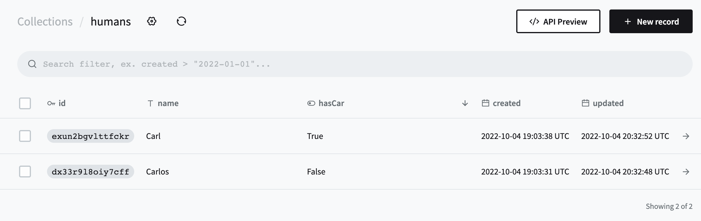

# WORK IN PROGRESS

## Usage
I use pnpm. <br>
This is the reason you see a `pnpm-lock.yaml`. That being said, any package manager will work. This file can be safely be removed.

## Start
```bash
$ pnpm install # or npm install or yarn install
```

## Then download pocketbase executable and place in folder backend (for example):

```bash
$ mkdir backend
```
then run this to start the pocketbase server (look in package.json under scripts to see why):
```bash
$ pnpm backend
```

### to use the example app found in ./src, create table `humans` with `name` as text (required) and `hasCar` as boolean:




In the project directory, you can now run:

###  `pnpm start`
<br>
This runs the app in the development mode.<br>
Open [http://localhost:3000](http://localhost:3000) to view it in the browser.
<br>
<br>


